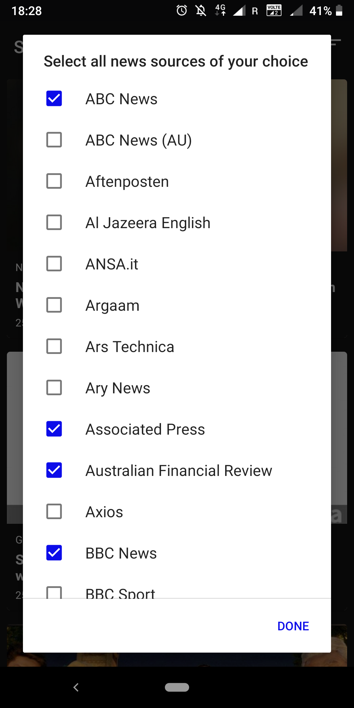

# Social News

A news application to get latest news based on users location. It uses Retrofit library to fetch the data from the API, Dagger2 for dependency injection and it also follows an MVP architechture pattern to keep the code clean and organized. The application has following features:
* A news feed showing latest news from the API https://newsapi.org/
* Show news based on the user's location.
* Allow users to search through the news from the feed.
* Store the news offline
* Everyday show a notification with a trending news to the user
* Allowing user to filter news based on sources and sort the news by date.

# Screenshots

<table>
    <tr>
     <td></td>
     <td></td>
     <td></td>
    </tr>
</table>

# Development guide

Click here (https://newsapi.org/register) to get an API key from https://newsapi.org (https://newsapi.org/). Place the API key in the Constants.java file in this project and simply run the project. 
Everything should work smoothly. Cheers :)
